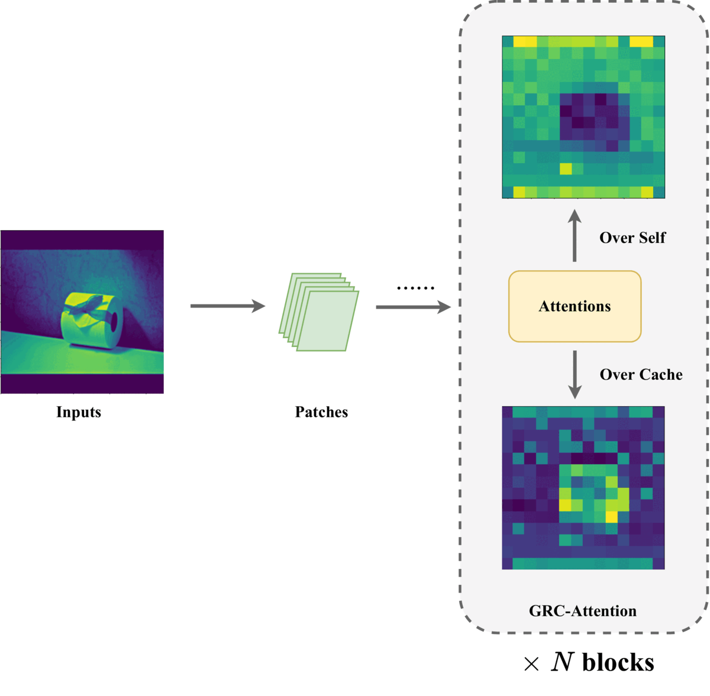

# Cached Transformers
This annoymous repo contains introductions and codes of paper "Cached Transformers".
 

## Introduction
In this work, we propose a novel family of Transformer model, called Cached Transformer, which has a gated recurrent caches (GRC), a lightweight and flexible widget enabling Transformers to access the historical knowledge.

